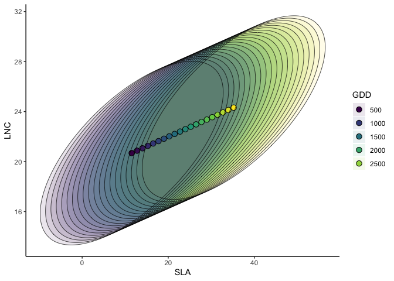
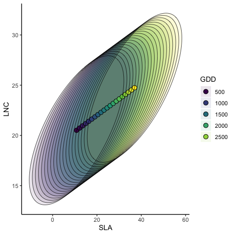
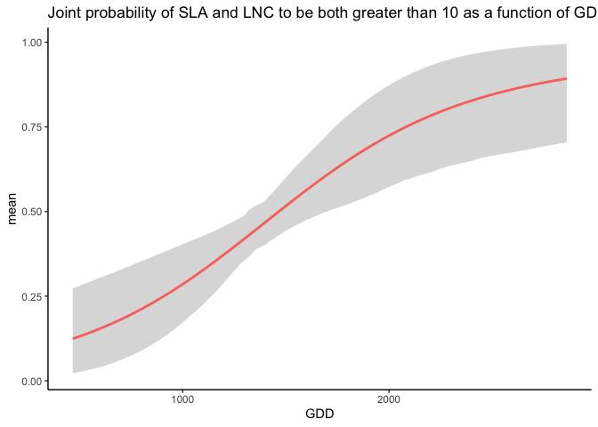

<!-- README.md is generated from README.Rmd. Please edit that file -->

[](http://www.repostatus.org/#active)
[](https://www.gnu.org/licenses/gpl-3.0)

# jtdm - Joint trait distribution modeling

## About the method

The method is described in Poggiato et al., in prep. Joint models and
predictions of community traits. The code for producing the results in
this paper is available under the subfolder publications in this repo.

The method itself is implemented in this repo.

## Installing the R package

### R-package

Install the package via

``` r
install_github("giopogg/jtdm")
```

The package implements jtdm using the Markov Chain Monte Carlo Bayesian
modeling software JAGS via the R package runjags. Therefore, it requires
the installation of both JAGS and runjags.

Once the dependencies are installed, the following code should run:

Fits a JTDM

``` r
library(jtdm)
```

    ## Warning: remplacement de l'importation précédente 'arm::traceplot' par
    ## 'coda::traceplot' lors du chargement de 'jtdm'

``` r
library(ggplot2)
set.seed(1712)
data(Y)
data(X)
# Short MCMC to obtain a fast example: results are unreliable !
m = jtdm_fit(Y=Y, X=X, formula=as.formula("~GDD+FDD+forest"),  adapt = 10, burnin = 100, sample = 100)
```

    ## module dic loaded

    ## Compiling rjags model...
    ## Calling the simulation using the rjags method...
    ## Note: the model did not require adaptation
    ## Burning in the model for 100 iterations...
    ## Running the model for 100 iterations...
    ## Extending 100 iterations for pD/DIC estimates...
    ## Simulation complete
    ## Calculating summary statistics...
    ## Calculating the Gelman-Rubin statistic for 21 variables....
    ## Note: Unable to calculate the multivariate psrf
    ## Finished running the simulation

``` r
# Inferred parameters
getB(m)$Bmean
```

    ##        (Intercept)         GDD       FDD    forest
    ## SLA       9.503057 0.009908142 0.5228900 11.623893
    ## LNC      20.906892 0.001300001 0.1433648  3.345966
    ## Height   10.847474 0.017353211 0.0707481  3.744054

``` r
get_sigma(m)$Smean
```

    ##              SLA       LNC     Height
    ## SLA     74.33726 16.867436 -13.645257
    ## LNC     16.86744  8.925394   0.846806
    ## Height -13.64526  0.846806  95.098501

Trait-environment relationships

``` r
partial_response(m,indexGradient="GDD",indexTrait="SLA",FixX=list(GDD=NULL,FDD=NULL,forest=1))$p
```

<!-- -->

Partial response curve of the most suitable community-level strategy and
envelop of possible community-level strategies of SLA and LNC along the
GDD gradient

``` r
ellipse_plot(m,indexTrait = c("SLA","LNC"),indexGradient="GDD")
```

<!-- -->

Computes joint probabilities of both SLA and LNC to be greater than 10
in the sites of the study.

``` r
joint = joint_trait_prob(m,indexTrait=c("SLA","LNC"), bounds=list(c(mean(Y[,"SLA"]),Inf),c(mean(Y[,"SLA"]),Inf)))
```

And this joint probability along the GDD gradient

``` r
joint=joint_trait_prob_gradient(m,indexTrait=c("SLA","LNC"), indexGradient="GDD", bounds=list(c(mean(Y[,"SLA"]),Inf),c(mean(Y[,"SLA"]),Inf)))

table = data.frame(x=joint$gradient, mean= joint$GradProbsmean,
                                   q02 = joint$GradProbsq025,
                                   q97 = joint$GradProbsq975)

 ggplot(data=table) + geom_ribbon(mapping=aes(x=x, ymin=q02, ymax=q97),position = position_dodge(0.3), size=1,alpha=0.2) + geom_line(mapping=aes(x=x, y=mean), size=1, position=position_dodge(width=0.3),col="#F8766D") + xlab("GDD")  + theme_classic() +              ggtitle("Joint probability of SLA and LNC to be both greater than 10 as a function of GDD")
```

<!-- -->
