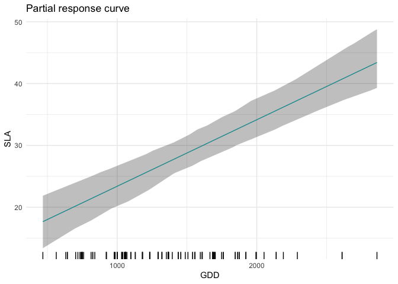

R package ‘jtdm’
================
Giovanni Poggiato
17/10/22

[](http://www.repostatus.org/#active)
[](https://www.gnu.org/licenses/gpl-3.0)

# jtdm - Joint trait distribution modeling

## About the method

The package jtdm implements the method described in Poggiato et al., in
prep. Joint models and predictions of community traits. The code for
producing the results in this paper is available under the subfolder
publications in this repo.

## Installing the R package

### R-package

The package implements jtdm using the Markov Chain Monte Carlo Bayesian
modeling software JAGS via the R package runjags. Therefore, it requires
the installation of JAGS. Its installation is easy and depends on your
operating system:

##### Ubutntu

sudo apt-get install jags

##### Windows

<https://sourceforge.net/projects/mcmc-jags/files/JAGS/4.x/Windows/>

##### Mac

<https://sourceforge.net/projects/mcmc-jags/files/JAGS/4.x/Mac%20OS%20X/>

Once JAGS has been installed, the following code should run:

``` r
library(devtools)
install_github("giopogg/jtdm")
```

The package implements jtdm using the Markov Chain Monte Carlo Bayesian
modeling software JAGS via the R package runjags. Therefore, it requires
the installation of both JAGS and runjags.

Fitting a JTDM the case study dataset of Poggiato et al. In prep.

``` r
library(jtdm)
library(ggplot2)
set.seed(1712)
data(Y)
data(X)
# Short MCMC to obtain a fast example: results are unreliable !
m = jtdm_fit(Y=Y, X=X, formula=as.formula("~GDD+FDD+forest"),  adapt = 10, burnin = 100, sample = 100)
## module dic loaded

# Inferred parameters
getB(m)$Bmean
get_sigma(m)$Smean
```

Trait-environment relationships

``` r
 partial_response(m,indexGradient="GDD",indexTrait="SLA",FixX=list(GDD=NULL,FDD=NULL,forest=1))$p
```

Partial response curve of the most suitable community-level strategy and
envelop of possible community-level strategies of SLA and LNC along the
GDD gradient.

``` r
ellipse_plot(m,indexTrait = c("SLA","LNC"),indexGradient="GDD")
```

<!-- -->

Computes joint probabilities of both SLA and LNC to be greater than 20
in a high altitude site. This measures the relative suitability of
communities where both SLA and LNC are higher than 20 in a high altitude
site.

``` r
joint_trait_prob(m,indexTrait=c("SLA","LNC"), Xnew=X["VCHA_2940",], bounds=list(c(20,Inf),c(20,Inf)))$PROBmean
##         1 
## 0.1230291
```

Unsurprisingly, the probability is low. Then, we compute how this
probability varies along the GDD gradient.

``` r
joint=joint_trait_prob_gradient(m,indexTrait=c("SLA","LNC"), indexGradient="GDD", bounds=list(c(mean(Y[,"SLA"]),Inf),c(mean(Y[,"SLA"]),Inf)))
```

And we plot it.

<!-- -->

As climatic conditions become more favourable (i.e. GDD increases), the
probability of having high values of both traits increases.

## Author

This package is currently developed by Giovanni Poggiato from
Laboratoire d’Ecologie Alpine. It is supported by the ANR GAMBAS. The
framework implemented in this package is described in: Joint modeling
and predictions of community traits. Poggiato Giovanni, Gaüzere Pierre,
Martinez Almoyna, Camille, Deschamps, Gabrielle, Renaud, Julien, Violle,
Cyrille, Münkemüller, Tamara, Thuiller, Wilfried. In preparation.
