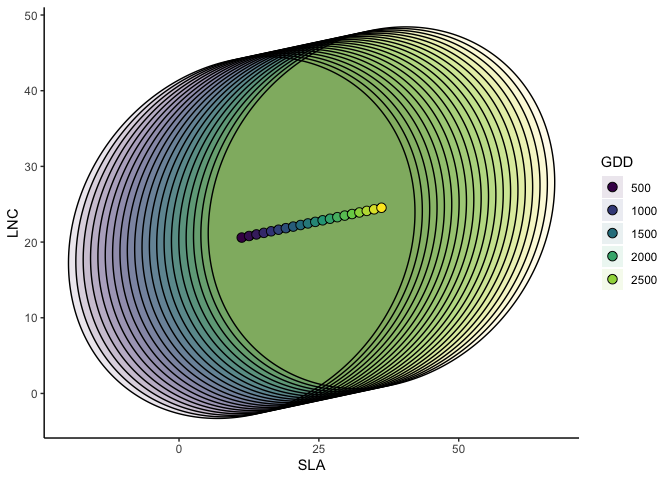
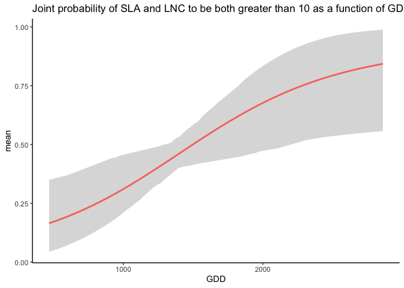
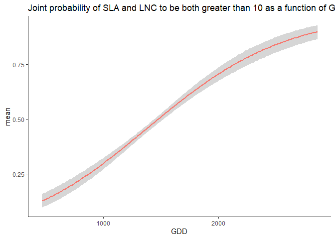

R package jtdm
================
Giovanni Poggiato
17/10/22

# 

# jtdm - Joint trait distribution modeling

## About the method

The package jtdm implements the method described in Poggiato et
al. (2023) <doi:10.1111/geb.13706>. The code for producing the results
of the paper is available in the subfolder publications in this repo.

## Installing the R package

``` r
## CRAN
#install.packages('jtdm', repos = "http://cran.us.r-project.org")
## Github
#library(devtools)
#install_github("giopogg/jtdm")
library(jtdm)
```

## Fit a jtdm to data

The package implements jtdm by sampling from the posterior distribution
of the parameters, which has been analytically determined. Therefore,
there is no need for classical MCMC convergence checks.

Fitting a JTDM the case study dataset of Poggiato et al. In prep.

``` r
library(ggplot2)
set.seed(1712)
data(Y)
data(X)
# Short MCMC to obtain a fast example: results are unreliable !
m = jtdm_fit(Y = Y, X = X, formula = as.formula("~GDD+FDD+forest"), sample = 1000)

# Inferred parameters
getB(m)$Bmean
get_sigma(m)$Smean 
```

### Show inferred model

We can have a first look to regression coefficients using the `summary`
function

``` r
summary(m)
```

And we can plot the regression coefficients and the residual covariance
matrix

``` r
plot(m)
```

<!-- -->

\###Trait-environment relationships

Single-trait trait-environment relationships

``` r
partial_response(m, indexGradient="GDD", indexTrait="SLA", 
                 FixX=list(GDD=NULL,FDD=NULL,forest=1))$p
```

<!-- -->

### Joint trait-environment relationships

Partial response curve of the most suitable community-level strategy and
envelop of possible community-level strategies of SLA and LNC along the
GDD gradient.

``` r
ellipse_plot(m,indexTrait = c("SLA","LNC"), indexGradient = "GDD")
```

<!-- -->

### Joint probabilities

Computes joint probabilities of both SLA and LNC to be greater than 20
in a high altitude site. This measures the relative suitability of
communities where both SLA and LNC are higher than 20 in a high altitude
site.

``` r
joint_trait_prob(m, indexTrait = c("SLA","LNC"), Xnew = X["VCHA_2940",],
                 bounds = list(c(20,Inf), c(20,Inf)), FullPost = TRUE)$PROBmean
##          1 
## 0.09809922
```

Unsurprisingly, the probability is low. Then, we compute how this
probability varies along the GDD gradient.

``` r
joint=joint_trait_prob_gradient(m,indexTrait=c("SLA","LNC"),
                                indexGradient="GDD",
                                bounds=list(c(mean(Y[,"SLA"]),Inf),c(mean(Y[,"SLA"]),Inf)),
                                FullPost = TRUE)
```

And we plot it.

    ## Warning: Using `size` aesthetic for lines was deprecated in ggplot2 3.4.0.
    ## ℹ Please use `linewidth` instead.
    ## This warning is displayed once every 8 hours.
    ## Call `lifecycle::last_lifecycle_warnings()` to see where this warning was
    ## generated.

<!-- -->

As climatic conditions become more favorable (i.e. GDD increases), the
probability of having high values of both traits increases.

## Author

This package is currently developed by Giovanni Poggiato from
Laboratoire d’Ecologie Alpine. It is supported by the ANR GAMBAS. The
framework implemented in this package is described in: Joint modeling
and predictions of community traits. Poggiato Giovanni, Gaüzere Pierre,
Martinez Almoyna Camille, Deschamps Gabrielle, Renaud Julien, Violle
Cyrille, Münkemüller Tamara, Thuiller Wilfried. In preparation.
