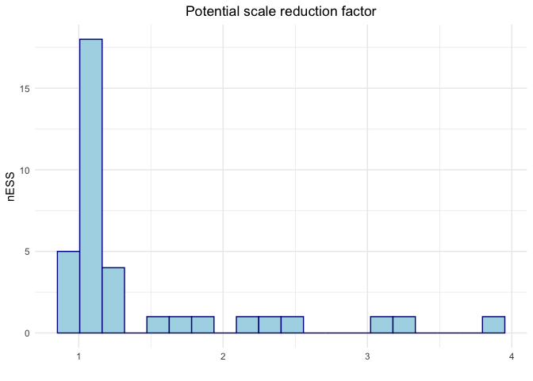
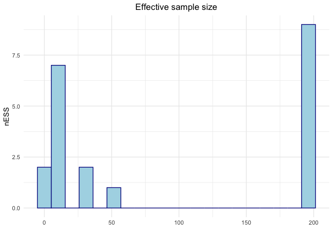
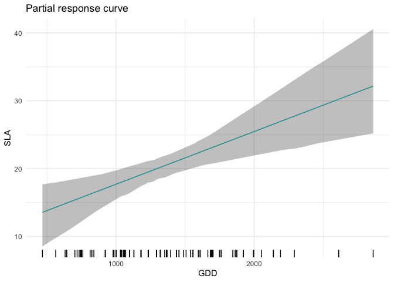
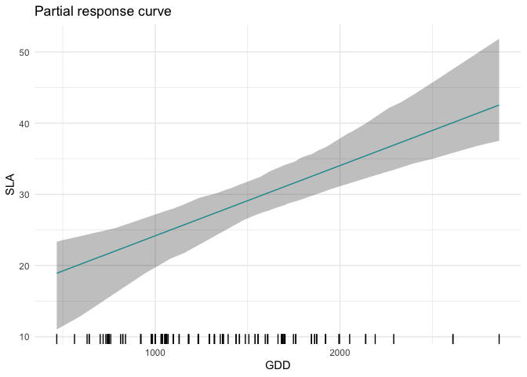
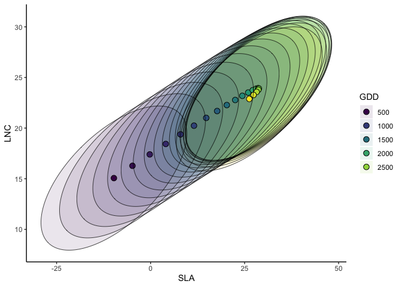
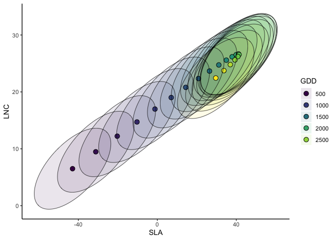
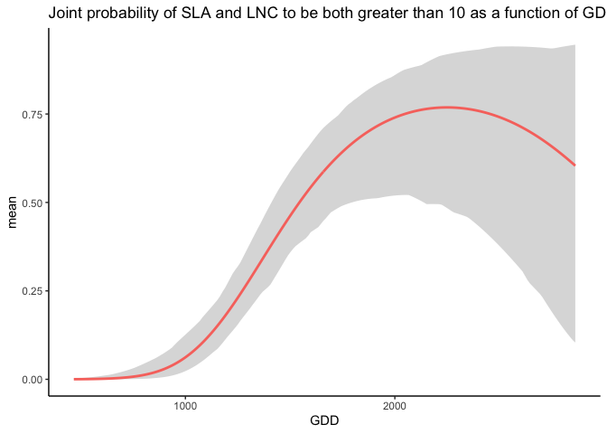

Vignette
================

# Fitting and evaluating a join trait distribution model

In this vignette we explain how to fit, evaluate and interpret a joint
trait distribution model (JTDM). We refer to Poggiato et al., in prep.
“Joint models and predictions of community traits” for the full
description of JTDMs, and we rather focus here on presenting the R
package by applying it to the dataset of the case study presented in the
publication.

# Installing the R package

### R-package

The package implements JTDMs using the Markov Chain Monte Carlo (MCMC)
Bayesian modeling software JAGS via the R package runjags. Therefore, it
requires the installation of JAGS. Its installation is easy and depends
on your operating system:

##### Ubutntu

sudo apt-get install jags

##### Windows

<https://sourceforge.net/projects/mcmc-jags/files/JAGS/4.x/Windows/>

##### Mac

<https://sourceforge.net/projects/mcmc-jags/files/JAGS/4.x/Mac%20OS%20X/>

Once JAGS has been installed, the following code should run:

``` r
library(devtools)
```

    ## Le chargement a nécessité le package : usethis

``` r
install_github("giopogg/jtdm")
```

    ## Downloading GitHub repo giopogg/jtdm@HEAD

    ## Installing 1 packages: cli

    ## installation du package source 'cli'

``` r
library(jtdm)
library(ggplot2)
library(coda)
```

JTDMs relate a vector of average community traits (e.g. community
weighted mean, CWM) to a vector of environmental covariates. The matrix
Y contains the CWM traits of specific leaf area (SLA), leaf nitrogen
content (LNC) and plant height of 116 plant community sites situated
along 21 elevational gradients (www.orchamp.osug.fr) in the French Alps.

``` r
data(Y)
summary(Y)
```

    ##       SLA              LNC            Height     
    ##  Min.   : 3.857   Min.   :14.86   Min.   :10.80  
    ##  1st Qu.:13.225   1st Qu.:19.71   1st Qu.:23.49  
    ##  Median :16.349   Median :21.42   Median :35.39  
    ##  Mean   :20.500   Mean   :22.06   Mean   :34.87  
    ##  3rd Qu.:21.923   3rd Qu.:23.88   3rd Qu.:44.17  
    ##  Max.   :66.664   Max.   :34.30   Max.   :76.38

We consider two environmental covariates: Growing Degree Days (GDD, the
sum of temperature of days with positive temperature in the growing
season) to represent the average length and intensity of the growing
season and intensity of freezing events (Freezing Degree Days, the sum
of temperature of days with negative temperature in the growing season,
FDD). To account for habitat type, we included a variable that was set
to 1 when the site was in a forest, 0 otherwise (hereafter habitat).
These data are stored in the matrix X.

``` r
data(X)
summary(X)
```

    ##       GDD              FDD              forest      
    ##  Min.   : 467.4   Min.   :-36.838   Min.   :0.0000  
    ##  1st Qu.:1037.3   1st Qu.:-14.768   1st Qu.:0.0000  
    ##  Median :1320.7   Median :-11.520   Median :0.0000  
    ##  Mean   :1357.6   Mean   :-12.758   Mean   :0.3621  
    ##  3rd Qu.:1684.9   3rd Qu.: -9.461   3rd Qu.:1.0000  
    ##  Max.   :2861.5   Max.   : -2.522   Max.   :1.0000

JTDMs infer a linear regression for each CWM trait as a function of the
environmental covariates, together with an inter-traits residual
covariance matrix. Therefore, the parameters of a JTDM are the
regression coefficients *B* and the residual covariance *Σ*. Notice that
inferring a generalized linear model is possible, even thus not yet
implemented in our package. The inference of JTDM is implemented in the
Bayesian framework (using JAGS) by the function `jtdm_fit`. The syntax
of the function is similar to the popular function `lm`. This function
requires the response matrix Y, the predictor matrix X and a (right-hand
only) formula to specify how CWM traits depends on environmental
variables. MCMC parameters are custom, details are described in
`?rjags`. We choose here to include in the model linear and quadratic
terms (using orthogonal polynomials) of GDD and FDD in interaction with
habitat to enable non linear trait-environment relationships and to
allow for different trait-environment relationships in forest and open
habitats. The is relatively fast, however, to ensure that the whole
vignette runs fast, we only run short MCMC chains here, for the sake of
the example. To obtain reliable results, the MCMC should be ran for a
higher number of iterations.

``` r
# Short MCMC to obtain a fast example: results are unreliable !
m = jtdm_fit(Y=Y, X=X, formula=as.formula("~poly(GDD,2)+poly(FDD,2)+poly(GDD,2):forest+poly(FDD,2):forest"),  adapt = 10, burnin = 100, sample = 100, n.chains = 2)
```

Once the model has ran, we should check for the convergence of the MCMC
chains.

``` r
# Potential scale reduction factor
table=data.frame(x=gelman.diag(m$model$mcmc,multivariate = FALSE)$psrf[,1])

ggplot(data = table, aes(x=x)) + geom_histogram(color="darkblue", fill="lightblue",bins = 20) +
  ggtitle("Potential scale reduction factor") + xlab("") + ylab("nESS") + theme_minimal() + theme(plot.title = element_text(hjust = 0.5))
```

<!-- -->

``` r
# nESS
table=data.frame(x=effectiveSize(mcmc(as.mcmc(m$model))))
ggplot(data = table, aes(x=x)) + geom_histogram(color="darkblue", fill="lightblue",bins = 20) +
  ggtitle("Effective sample size") + xlab("") + ylab("nESS") + theme_minimal() + theme(plot.title = element_text(hjust = 0.5))
```

<!-- -->

Since we ran the JTDM with very short chains, the MCMC has not
converged. You can try to run the model with longer chains and check its
convergence.

We can now look at the inferred the regression coefficients. The `getB`
function provides the MCMC samples of the regression coefficients matrix
*B*, together with its mean, and 95% credible interval.

``` r
# Inferred parameters
B=getB(m)
```

`get_sigma` provides instead the MCMC samples of the residual covariance
matrix *Σ* together with its mean and 95% credible interval.

``` r
Sigma=get_sigma(m)$Smean
```

We can predict CWM traits on a (new) set of sites using `jtdm_predict`.
Here, we predict on the training dataset and compute goodness of fit
measures of these predictions like *R*<sup>2</sup> and RMSE, by setting
`validation=TRUE`. We can choose whether to obtain the full posterior
predictive distribution (`FullPost=TRUE` which is more time consuming)
or just its posterior mean (`FullPost=FALSE`, which we advice if the aim
is to only compute goodness of fit measures).

``` r
predictions = jtdm_predict(m,Xnew=X,Ynew=Y,validation=T, FullPost=F)
predictions$R2
```

    ##       SLA       LNC    Height 
    ## 0.5846196 0.3494882 0.5201757

``` r
predictions$RMSE
```

    ##      SLA      LNC   Height 
    ## 7.637141 2.809050 9.140805

We can evaluate the performances of the model using a K-fold
cross-validation using the function `jtdmCV`

``` r
predictionsCV = jtdmCV(m,K=5)
```

``` r
predictionsCV$R2
```

    ##       SLA       LNC    Height 
    ## 0.5101005 0.2333333 0.4774889

``` r
predictionsCV$RMSE
```

    ## [1]  8.218728  3.063258 10.105508

We can now analyse the inferred trait-environment relationships using
the function `partial_response`, that computes and plots the partial
response curve of a focal trait along a focal environmental gradient.
This function takes as input the model `m`, the focal environmental
variable `indexGradient` and the focal trait `indexTrait`, using the
names of environmental variables and traits as specified in the column
names of X and Y respectively. The function builds a dataset of
environmental variables by building the gradient of the focal
environmental variable and keeping all other variables fixed to their
mean. Then, it predicts the marginal distribution of the focal trait for
the so-built environmental dataset. The user can choose whether to
obtain the full predictive distribution (`FullPost=TRUE`), or the
predictive distribution of the mean term (`FullPost="mean"`, which we
advice here), or just the posterior mean (`FullPost="mean"`). The
function outputs are the plot of the inferred trait-environment
relationship and the predictions of the model (used to produce the
plot). For example, we can plot the partial response curve relationship
between SLA and GDD

``` r
partial_response(m,indexGradient="GDD",indexTrait="SLA")$p
```

<!-- -->

The user can eventually provide a given gradient for the focal
environmental variable `XFocal` (which is otherwise built on regual grid
with length given by `grid.length`). The user can also choose to fix the
non focal environmental variables to another value. For example, we can
obtain the partial response curve of SLA and GDD in forest

``` r
partial_response(m,indexGradient="GDD",indexTrait="SLA",FixX=list(GDD=NULL,FDD=NULL,forest=1))$p
```

<!-- -->

We can then compute the partial response curves of pairwise CWM trait
combinations together with their 95% credible region, what we define in
the publication as the most suitable CLS and envelop of possible CLSs.
This is done by the function `ellipse_plot`, that takes as input the
model `m`, the focal environmental variable `indexGradient` and the two
focal traits `indexTrait`, using the names of environmental variables
and traits as specified in the column names of X and Y respectively. The
function builds a gradient of the focal environmental variable while
keeping all other variables fixed to their mean, and then predict and
plots the joint distribution of the focal traits. The user can choose
whether to obtain the full predictive distribution (`FullPost=TRUE`), or
the predictive distribution of the mean term (`FullPost=F`, which we
advice here to obtain smoother curves).

``` r
# plot the pairwise SLA-LNC partial response curve along the GDD gradient
ellipse_plot(m,indexTrait = c("SLA","LNC"),indexGradient="GDD")
```

<!-- -->

The user can also choose to fix the non-focal environmental variables to
another value. For example, we can obtain the partial response curves of
the most suitable CLS and envelop of possible CLSs of SLA and GDD in
forest.

``` r
# plot the pairwise SLA-LNC partial response curve along the GDD gradient
ellipse_plot(m,indexTrait = c("SLA","LNC"),indexGradient="GDD",FixX=list(GDD=NULL,FDD=NULL,forest=1))
```

<!-- -->

The `jtdm` package allows to define a region in the community-trait
space and compute their joint probabilities for a given set of
environmental conditions. This is done by the function
`joint_trait_prob`. To define a given region in the community-trait
space, the user has to define the focal traits `indexTrait` (any number
of traits is accepted) and trait-specific tresholds through the
parameter `bounds`. `bounds` is a list of the length of `indexTrait`,
where each element of the list is a vector of length two. The vector
represents the inferior and superior bounds of the region for the
specified trait. For example, if we consider two traits (e.g. SLA and
LNC), `bounds=list(c(20,Inf),c(20,Inf))` corresponds to the region in
the community-trait space where both SLA and LNC both take values
greater than 20. We can then define the sites (i.e. the set of
environmental conditions) in which to compute joint probabilities. For
example we can compute joint probabilities of both SLA and LNC to be
greater than 20 in a high altitude site. This measures the relative
suitability of communities where both SLA and LNC are higher than 20 in
a high altitude site.

``` r
joint_trait_prob(m,indexTrait=c("SLA","LNC"), Xnew=X["VCHA_2940",], bounds=list(c(20,Inf),c(20,Inf)))$PROBmean
```

    ##          1 
    ## 0.09052488

Unsurprisingly, the probability is low. Then, we compute how this
probability vary along the GDD gradient using the function
`joint_trait_prob_gradient`. The function builts a dataframe where the
focal variable varies along a gradient and the other (non-focal)
variables are fixed to their mean (but see FixX parameter for fixing
non-focal variables to user-defined values) and predict the joint
probabilities along the gradient.

``` r
joint=joint_trait_prob_gradient(m,indexTrait=c("SLA","LNC"), indexGradient="GDD", bounds=list(c(mean(Y[,"SLA"]),Inf),c(mean(Y[,"SLA"]),Inf)))
```

We can then plot such predictions.

<!-- -->

As climatic conditions become more favorable (i.e. GDD increases), the
probability of having high values of both traits increases.
